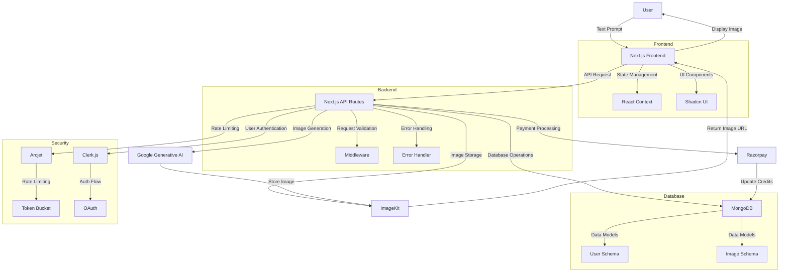

# Imagify

[](https://nextjs.org)
[](https://reactjs.org)
[](https://tailwindcss.com)
[](https://www.mongodb.com)
[](https://clerk.dev)
[](https://razorpay.com)
[](https://arcjet.com)
[](https://ai.google.dev)
[](https://opensource.org/licenses/MIT)
[](http://makeapullrequest.com)

## 📝 Overview

Imagify is a cutting-edge SaaS platform that revolutionizes image creation through artificial intelligence. By leveraging Google's powerful Generative AI, Imagify transforms text descriptions into stunning, high-quality images in seconds. This production-ready application is designed for scalability, security, and exceptional user experience.

### 🎯 Mission

Our mission is to democratize image creation by making AI-powered image generation accessible to everyone, from creative professionals to casual users. We believe in empowering users to bring their imagination to life through simple text prompts.

### 🌟 Vision

To become the leading platform for AI-powered image generation, continuously innovating and improving our technology to deliver the best possible results for our users.

## ✨ Key Features

### 🎨 AI-Powered Image Generation
- **Advanced AI Model**: Utilizes Google's state-of-the-art Generative AI for high-quality image generation
- **Text-to-Image Conversion**: Transform detailed text descriptions into stunning visuals
- **Multiple Style Options**: Generate images in various artistic styles and formats
- **High-Resolution Output**: Create images suitable for professional use

### 🔐 User Authentication & Security
- **Secure Authentication**: Powered by Clerk.js for robust user management
- **Role-Based Access**: Different access levels for users and administrators
- **Session Management**: Secure and persistent user sessions
- **OAuth Integration**: Social login options for convenience

### 💰 Credit System
- **Token-Based Credits**: Flexible system for managing user credits
- **Multiple Plans**: Choose from Basic, Advanced, and Enterprise plans
- **Credit History**: Track credit usage and transactions
- **Auto-Renewal**: Optional automatic credit renewal

### 💳 Payment Integration
- **Secure Payments**: Razorpay integration for safe transactions
- **Multiple Payment Methods**: Support for various payment options
- **Automated Billing**: Streamlined billing process
- **Transaction History**: Detailed payment records

### 🛡️ Security & Protection
- **Rate Limiting**: Arcjet integration for API protection
- **Bot Protection**: Advanced bot detection and prevention
- **DDoS Protection**: Protection against distributed denial-of-service attacks
- **Data Encryption**: End-to-end encryption for sensitive data

### 🎯 User Interface
- **Responsive Design**: Optimized for all device sizes
- **Modern UI**: Built with Tailwind CSS and Shadcn UI
- **Intuitive Navigation**: User-friendly interface
- **Dark/Light Mode**: Support for different themes

### 📦 Image Storage
- **Efficient Storage**: ImageKit integration for optimized image storage
- **CDN Delivery**: Fast content delivery through global CDN
- **Image Optimization**: Automatic image optimization
- **Secure Access**: Protected image access

## 🏗️ Technical Architecture

### Frontend Architecture
- **Next.js App Router**: Modern routing system
- **React Components**: Modular and reusable components
- **State Management**: Context API for global state
- **API Integration**: RESTful API communication
- **Error Handling**: Comprehensive error boundaries
- **Loading States**: Optimistic UI updates

### Backend Architecture
- **API Routes**: Next.js API routes for backend logic
- **Middleware**: Request processing and validation
- **Error Handling**: Global error handling
- **Rate Limiting**: Request throttling
- **Caching**: Response caching for performance

### Database Architecture
- **MongoDB Schema**: Optimized data models
- **Indexing**: Performance optimization
- **Data Validation**: Schema validation
- **Connection Pooling**: Efficient database connections

### Security Architecture
- **Authentication Flow**: Secure user authentication
- **Authorization**: Role-based access control
- **API Security**: Rate limiting and protection
- **Data Encryption**: Secure data transmission

## 🔄 System Flow



## 🚀 Getting Started

### Prerequisites
- Node.js (v18 or higher)
- npm or yarn
- MongoDB instance
- Google Cloud account (for Generative AI)
- Razorpay account
- Clerk.js account
- ImageKit account
- Arcjet account

### Installation

1. **Clone the Repository**
   ```bash
   git clone https://github.com/yourusername/imagify.git
   cd imagify
   ```

2. **Install Dependencies**
   ```bash
   npm install
   # or
   yarn install
   ```

3. **Environment Setup**
   Create a `.env.local` file in the root directory:
   ```env
   # Database
   MONGODB_URI=your_mongodb_uri

   # Authentication
   CLERK_SECRET_KEY=your_clerk_secret_key
   CLERK_PUBLISHABLE_KEY=your_clerk_publishable_key

   # Payment
   RAZORPAY_KEY_ID=your_razorpay_key_id
   RAZORPAY_KEY_SECRET=your_razorpay_key_secret

   # Security
   ARCJET_KEY=your_arcjet_key

   # AI
   GEMINI_API_KEY=your_gemini_api_key

   # Image Storage
   IMAGEKIT_PUBLIC_KEY=your_imagekit_public_key
   IMAGEKIT_PRIVATE_KEY=your_imagekit_private_key
   IMAGEKIT_URL_ENDPOINT=your_imagekit_url_endpoint

   # Application
   NEXT_PUBLIC_APP_URL=http://localhost:3000
   ```

4. **Development Server**
   ```bash
   npm run dev
   # or
   yarn dev
   ```
   Access the application at [http://localhost:3000](http://localhost:3000)

5. **Production Build**
   ```bash
   npm run build
   npm start
   # or
   yarn build
   yarn start
   ```

## 📖 Usage Guide

### User Authentication
1. **Sign Up**
   - Click "Sign Up" button
   - Choose authentication method (email or social)
   - Complete registration process

2. **Login**
   - Enter credentials
   - Access dashboard

### Image Generation
1. **Create Image**
   - Navigate to dashboard
   - Enter text prompt
   - Select style options
   - Click "Generate"

2. **Manage Images**
   - View generated images
   - Download images
   - Share images
   - Delete images

### Credit Management
1. **Purchase Credits**
   - Select plan
   - Complete payment
   - Credits added to account

2. **Track Usage**
   - View credit balance
   - Check usage history
   - Monitor remaining credits

## 🤝 Contributing

We welcome contributions! Please follow these steps:

1. **Fork Repository**
   ```bash
   git clone https://github.com/yourusername/imagify.git
   ```

2. **Create Branch**
   ```bash
   git checkout -b feature/your-feature
   ```

3. **Make Changes**
   - Follow coding standards
   - Add tests if applicable
   - Update documentation

4. **Commit Changes**
   ```bash
   git commit -m "Add your feature"
   ```

5. **Push Changes**
   ```bash
   git push origin feature/your-feature
   ```

6. **Create Pull Request**
   - Fill PR template
   - Add description
   - Request review

### Development Guidelines
- Follow ESLint rules
- Write meaningful commit messages
- Add tests for new features
- Update documentation
- Follow Git flow

## 📄 License

This project is licensed under the MIT License - see the [LICENSE](LICENSE) file for details.

## 📞 Support

- **Email**: [support@imagify.com](mailto:support@imagify.com)
- **Documentation**: [docs.imagify.com](https://docs.imagify.com)
- **Community**: [community.imagify.com](https://community.imagify.com)

## 🙏 Acknowledgments

- Google Generative AI team
- Next.js team
- Clerk.js team
- Razorpay team
- ImageKit team
- Arcjet team
- All contributors

---

Built with ❤️ by the Imagify Team
